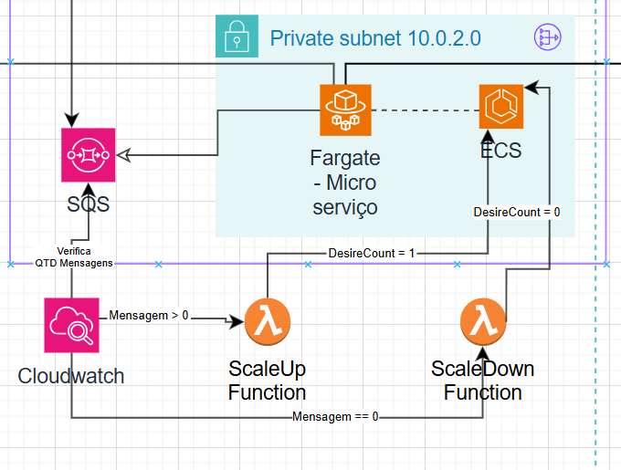

# Microserviço (ECS +Fargate)

## Visão Geral
O objetivo deste microserviço é fornecer a capacidade de processamento de imagens de avaliações, permitindo que os professores possam avaliar as provas de forma automática e otimizada.
Este microserviço será hospedado na Nuvem AWS, utilizando o ECS para gerenciamento de containers e Fargate para provisionamento de containers. A imagem do microserviço será armazenada no ECR para facilitar a manutenção e deploy.

## Configuração

### Microserviço (ECS + Fargate)
**Nome do Cluster:** avalia-ai-cluster

**Nome do Service:** avalia-ai-service

**Nome do Task Definition:** avalia-ai-task-definition

**Nome do Container:** avalia-ai-container

## Escalonamento Automático:
O microserviço será escalonado de forma automática, conforme a demanda, utilizando o SQS e o Alarme do CloudWatch com Funções Lambda.
Por exemplo: Se houver uma ou mais provas pendentes na fila de envio de mensagens e não houver nenhum worker em execução. O Alarme do CloudWatch irá acionar as Funções Lambda, que irão criar novos workers para processar as provas pendentes.

No entanto, se houver um ou mais workers online e nenhuma prova pendente na fila de envio de mensagens. O Alarme do CloudWatch irá acionar as Funções Lambda, que irão encerrar os workers online.

Conforme mostrado no diagrama abaixo:

